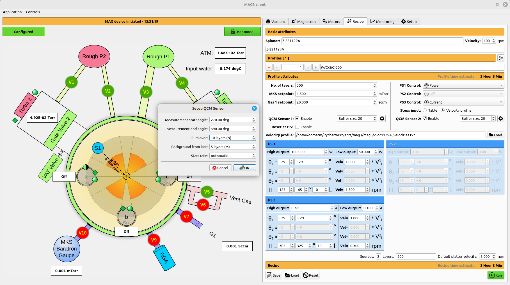

# MAG 3 setup
***
In MAG3 we have multiple user inputs for active QCM feedback. Here is how GUI looks like.

Let's consider only `S1` sensor as everything is the same for `S2`.  

We are interested in **Buffer size** (`s1_nth_buffer_size`) which is size of the buffer which holds `signal - background` values. This is circular buffer of fixed size `s1_cumulative_buffer`.
In the situation we have on screen `s1_nth_buffer_size` = 20.  

Then we have two other values `N` - **Sum over N layers** and `M` - **Background from last M layers**.
Those two number are used to get calculated signal from `N` measured layers and subtracting background from last `M` layers of that series.
After that we have 1 new entry in `s1_cumulative_buffer`. Maximum of 20 in total.

In the recipe we are not calculating new velocity factor until we have `s1_cumulative_buffer` full.

Then whenever platter is entering area of `S1` (-29 deg, +29 deg) we calculate new factor (`vel_factor`) with which we multiply velocity in that region.  
***
Now, we have your approach using different smoothing method. What I would need, is to map those variables and user inputs to your functions.
As we discussed we have to first train it and then using it.  
In your example there were multiple functions to train. Can you simplify it to one function with input like one list of `signals` which would then gives me values I need for smoothing. Or something similar.
Do we need any additional values from the user we should add to the GUI?